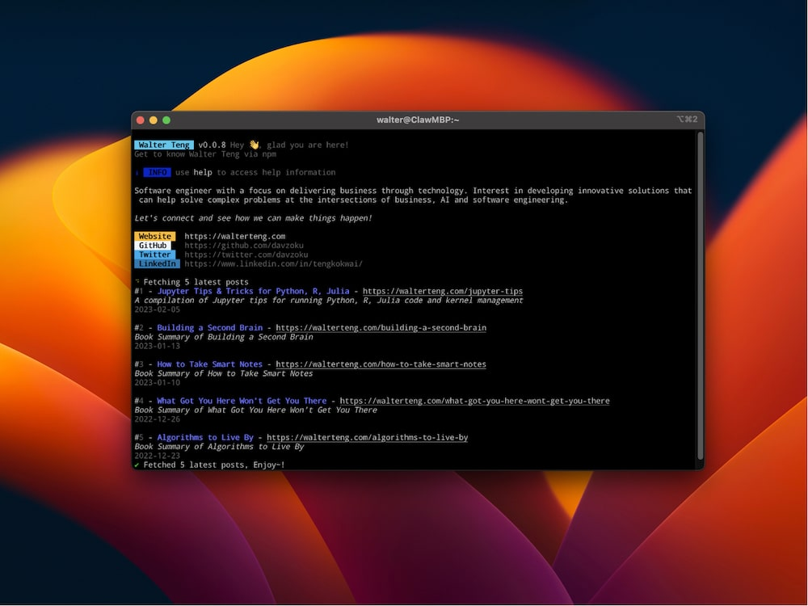

# walter-teng-cli

Get to know Walter Teng via npm.



see [Walter Teng CLI](https://walterteng.com/walter-teng-cli) for more detailed info.

## Instructions

To use this CLI, run the following command:

```sh
npx walter-teng
```

Alternatively, run the following command to install this package:

```sh
npm install -g walter-teng
```

## Usage

To execute the CLI:

```
walter-teng
```

To access the help instructions

```
walter help
```

To fetch latest posts from [walterteng.com](https://walterteng.com/)

```
walter -p
```

or

```
walter --posts
```

## References

Inspired by following resources:

- [ahmadawais/awais](https://github.com/ahmadawais/awais):
- [ahmadawais/lwj-cli](https://github.com/ahmadawais/lwj-cli)
- [Automating Tasks with Node CLIs (with Ahmad Awais) — Learn With Jason - YouTube](https://www.youtube.com/watch?v=V1GkmB7T7Ps)
